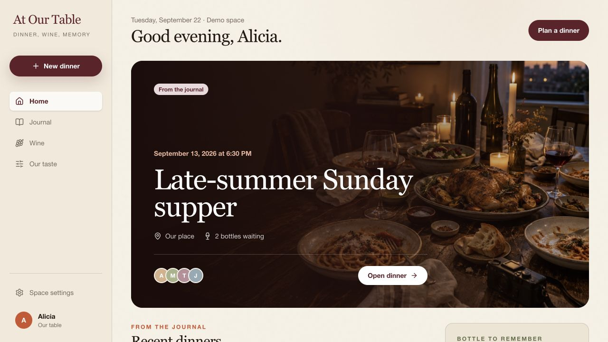
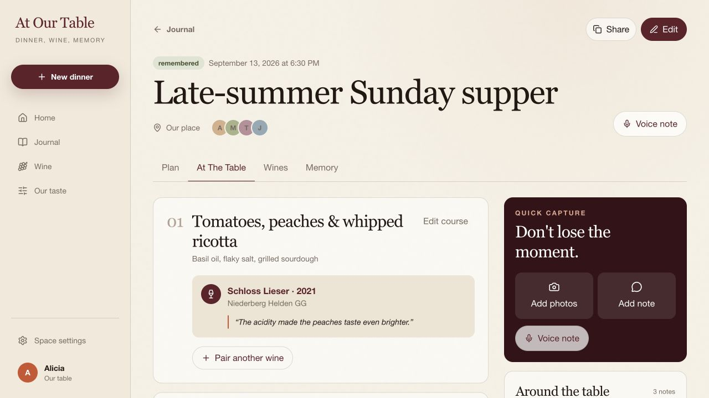
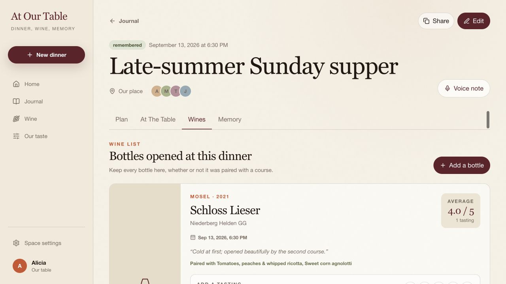

# At Our Table

**Plan dinner, pair the wine, and remember what you loved.**

A warm, private dinner and wine journal for the people you share a table with. Plan a menu, record every bottle, add notes and photos while the evening is happening, then return to the memory later.

[Open the live app](https://at-our-table-plum.vercel.app) · [Read the build spec](docs/BUILD_SPEC.md)



## One dinner, from plan to memory

A dinner is a mutable record rather than a one-time form. It can begin as a plan, change at the table, and become a journal entry afterward.

- Create home or restaurant dinners with any number of courses and guests.
- Add multiple wines to one dish—or keep a bottle unpaired.
- Save photos, written notes, browser-recorded voice notes, and a journal cover.
- Keep dates and times visible throughout the home, journal, dinner, and wine-history views.
- Invite another Google account into the same private space or create a capability-scoped collaboration link for one dinner.



## Wine is history, not just inventory

`Wine` describes the bottle itself. `Wine Experience` describes opening that bottle at a particular dinner. Explicit dish-to-wine pairings connect the two without forcing every bottle to belong to a course.

Each person can append a new 1–5 score and tasting note whenever they try the wine. The displayed score is the average of those individual tasting entries, preserving the full history rather than overwriting the last opinion.



## Highlights

- **Menu and pairing ideas** — draft a menu and generate an explainable wine recommendation for every named course.
- **Flexible wine list** — open several bottles, pair one bottle with several dishes, or enjoy it on its own.
- **Wine-label scan** — members and invited dinner collaborators can select up to two front/back bottle photos and prefill editable producer, cuvée, vintage, origin, grapes, color, introduction, and provisional tasting notes. Newly scanned bottles are saved to the space wine journal.
- **Memory capture** — upload many private photos, write notes, and record voice notes from desktop or mobile.
- **Editorial thumbnails** — use the original dinner photo or generate a clean abstract memory panel with the pinned [Photo Abstract Editorial](https://github.com/ZzzLc0405/photo-abstract-editorial) skill prompt by @AM (personal/non-commercial use).
- **Shared taste** — derive the space's preferences from actual tasting logs and dinner history.
- **Private by default** — Google authentication, private Storage, hashed share tokens, and Postgres row-level security restrict data to space members.

## Domain model

```text
Space
├── Members
├── Dinners
│   ├── Courses
│   ├── Wine Experiences ── Wine
│   ├── Dish ↔ Wine Pairings
│   ├── Tasting Logs
│   ├── Photos / Voice Notes / Notes
│   └── Read-only Share Links
└── Wine Journal
```

The separation between a canonical wine and each time it is opened prevents dinner-specific serving notes, ratings, and pairings from polluting the bottle's identity.

## Stack

- Next.js 16 App Router, React 19, and TypeScript
- Tailwind CSS
- Supabase Auth, Postgres, private Storage, RPCs, and RLS
- OpenAI image understanding for label scans and editorial cover generation
- Vercel hosting with GitHub-connected deployments

## Run locally

```bash
npm install
cp .env.example .env.local
npm run dev
```

Open [http://localhost:3000](http://localhost:3000).

With no environment variables, the app runs as a fully interactive demo and keeps dinners, wines, ratings, notes, photos, invitations, shares, and preferences in browser storage. Add Supabase variables to use Google sign-in, Postgres, private Storage, and multi-member spaces.

```bash
NEXT_PUBLIC_SUPABASE_URL=your-project-url
NEXT_PUBLIC_SUPABASE_PUBLISHABLE_KEY=your-publishable-key
OPENAI_API_KEY=your-server-only-key
```

`OPENAI_API_KEY` is server-only. It enables wine-label recognition and editorial cover generation and is never sent to the browser. `OPENAI_WINE_MODEL` and `OPENAI_IMAGE_MODEL` can optionally override their defaults.

## Supabase setup

1. Create a Supabase project and enable the Google provider.
2. Add `http://localhost:3000/auth/callback` and the production callback URL to the Auth redirect allow list.
3. Link and publish the migrations:

   ```bash
   npx supabase link --project-ref <project-ref>
   npx supabase db push --dry-run
   npx supabase db push
   ```

4. Copy `.env.example` to `.env.local` and add the project URL and publishable key.

The migrations create a private `dinner-media` bucket. Object paths begin with the space UUID—for example, `<space-id>/<dinner-id>/<file>` for dinner media, `<space-id>/wine-labels/<file>` for member bottle labels, and a token-hash-scoped path for labels added from an active dinner collaboration link.

New accounts receive a private space automatically. Invitations are bound to the intended email address and share tokens are stored as hashes. Dinner collaboration links expose a curated capability: holders can edit that dinner's menu, reorder courses, and add or pair wine, while photos, notes, ratings, guests, and wine event history remain private. Label uploads are restricted to the active link's space and token-hash path.

## Quality checks

```bash
npm run lint
npm run typecheck
npm run check:mobile
npm run check:covers
npm run build
```

The regression checks cover mobile feature parity, local date/time round-tripping, and clean abstract-panel thumbnail extraction.
